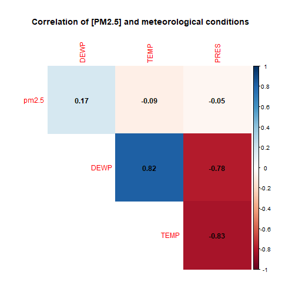
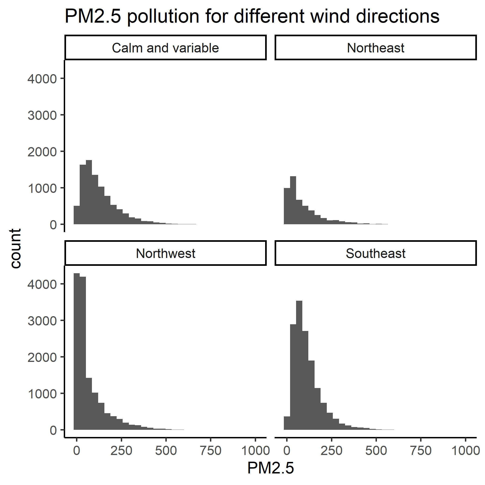
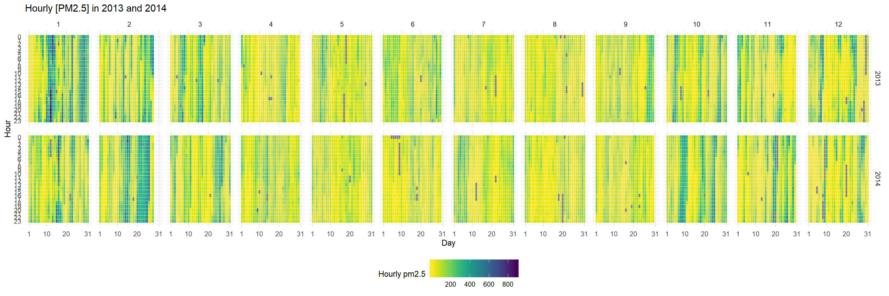
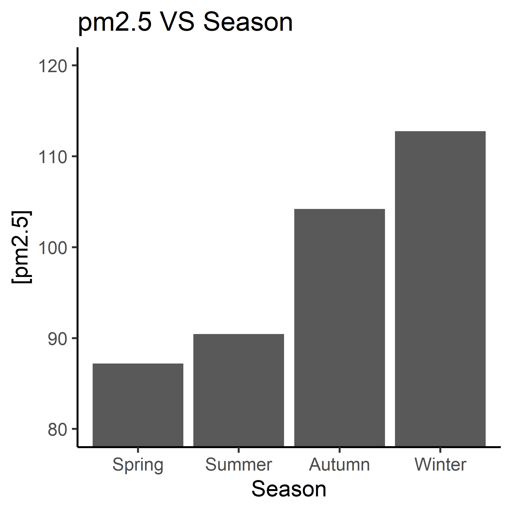
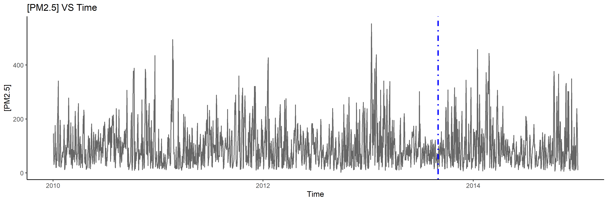

```{r setup, include=FALSE}
knitr::opts_chunk$set(echo = TRUE)
library(knitr)
library(tidyverse)
library(here)
library(corrplot)
library(foreign)
library(lubridate) # make it easier to parse and manipulate dates
library(viridis) # colour blind friendly palette
```

# Beijing PM2.5   
## Introduction  
Beijing, the capital city of China, has been fighting against `PM2.5` pollution in recent years. `PM2.5` are fine airborne particles less than 2.5μm that can cause severe damage to human health by triggering lung cancer, heart diseases, stroke, and respiratory infections. A Nature study pointed out that in 2016 only, `PM2.5` was associated with over four million deaths worldwide. In the past decades, the air quality in Beijing has been faced with great pressure resulting from the rapid development of industry. In order to secure its citizens’ health, Chinese government has taken action to mitigate the influence of `PM2.5` since September, 2013.      
Previous studies showed that meteorological conditions(wind, humidity, etc) could contribute to the formation of `PM2.5`. Therefore, we speculate that there could be correlations between Beijing’s `PM2.5` concentration and the meteorological conditions in a sufficient period of time. 

## Research Question    
Our main research question is an _exploratory_ question: does the `PM2.5` in Beijing correlates with meteorological conditions and time? We speculate that there is indeed a correlation and that knowing the meteorological conditions can support the assessment and even prediction of air quality in Beijing. Sub-questions are as follows:    
-	`PM2.5` VS. physical parameters (dew point, temperature and pressure).    
-	`PM2.5` VS. wind.     
-	`PM2.5` VS. special weather conditions (rain and snow).     
-	`PM2.5` VS. time (year, month, a time in a day). 

## Data Description  
The [dataset](https://archive.ics.uci.edu/ml/machine-learning-databases/00381/PRSA_data_2010.1.1-2014.12.31.csv) we used is from [University of California Irvine Machine learning Repository](https://archive.ics.uci.edu/ml/datasets/Beijing+PM2.5+Data#). It was originally uploaded by Songxi Chen in Peking University, China. This is an hourly dataset containing the `PM2.5` concentration and meteorological statistics in Beijing collected from Jan 1st, 2010 to Dec 31st, 2014.

Below are the variables in the dataset:    

| Variable          | Type             | Description | 
|-------------------|------------------|-------------|
| year              | Quantitative     |Year of data in this row|
| month             | Quantitative     |Month of data in this row|
| day               | Quantitative     |Day of data in this row|
| hour              | Quantitative     |Hour of data in this row|
| `PM2.5`           | Quantitative     |`PM2.5` concentration (ug/m^3)|
| DEWP              | Quantitative     |Dew Point (℃)|
| TEMP              | Quantitative     |Temperature (℃)|
| PRES              | Quantitative     |Pressure (hPa)|
| cbwd              | Categorical      |Combined wind direction|
| lws               | Quantitative     |Cumulated wind speed (m/s)|
| ls                | Quantitative     |Cumulated hours of snow|
| lr                | Quantitative     |Cumulated hours of rain|

```{r, echo=FALSE}
# This code chunk is used to generate in-line values and numbers
df<-read.csv("https://archive.ics.uci.edu/ml/machine-learning-databases/00381/PRSA_data_2010.1.1-2014.12.31.csv")
df_clean<- na.omit(df)
```


## Exploratory data analysis (EDA)
### 1.Correllogram   

First we would like to address the correlation between meteorological conditions and `PM2.5` concentration.The correllogram below shows very weak correlations between dew point (DEWP), temperature (TEMP) or pressure (PRES) and `PM2.5`concentration. Thus, it might not be that appropriate to use these meteorological conditions to predict the `PM2.5` situation in Beijing.    

     

### 2.Faceted histogram	   

Wind is one of the important elements of weather conditions, and could also influence the formation of `PM2.5`. Thus, we used a faceted histogram to check the distribution of `PM2.5` under different wind directions. The Y axis in the image below is the count of a certain PM2.5 concentration, indicating the severity of PM2.5 pollution. Each facet stands for a wind direction*. We can conclude from the figures that:      

- Generally, the PM2.5 concentration ranges from `r min(df_clean$pm2.5)` to `r max(df_clean$pm2.5)`; and during most of the time it is below `r median(df_clean$pm2.5)` (median) regardless of the wind direction.     
- When the wind direction is southwest, the severity of PM2.5 pollution seems to be the lowest, as lower PM2.5 concentrations are more likely to occur. In comparison, winds coming from the northeast tend to result in more severe pollution compared to the others.     
_*Only northeast, southwest, southeast and calm and variable were recorded in the wind direction; northwest was somehow missed._      

      


### 3.Heat map

```{r, echo=FALSE}
# These two datasets are genaerated to calculate the mean of [PM2.5] before and after the action
mean_before <- df_clean %>% 
  filter(year == 2013 & month < 9)
mean_after<- df_clean %>% 
  filter(year == 2014 | (year == 2013 & month > 8))
```

In addition to meteorological conditions, we are curious about the correlation between `PM2.5` concentration and time, so we generated a heat map and came up with conclusions as below:

- By comparing __2013 and 2014__, we attempted to see if there is any decrease in `PM2.5` concentration that could possibly result from a plan of Chinese government that aims to improve the air quality, which started in September in 2013. We could not find significant color differences between the two years, though there is a slight drop in the mean of`PM2.5` concentration(before: `r mean(mean_before$pm2.5)`; after: `r mean(mean_after$pm2.5)`).      

- By comparing different __months__, we can conclude that although the concentration of `PM2.5` can be high (> mean value (`r mean(df_clean$pm2.5)`) at some points in every month (dark dots), the pollution is more serious when it enters October and reaches its peak in January/February. This finding is similar to previous studies that point out that the worst case happens in autumn and winter.       

   * It is reasonable when taking the conclusion drawn above about the impact of the __wind direction__ into account: located in the northern part of China, Beijing experiences the wind coming from the north from September to early March, which can result in a more serious pollution. In comparison, the wind comes from the south from late March to August, leading to less formation of `PM2.5` particles, so the air condition is better.      

- By comparing different __hours__ within a day, we were considering if `PM2.5` concentration is higher in the morning and evening but lower at noon. However, although our hypothesis can be true in some winter days, `PM2.5` concentration seems to be stable within a day during most of the time.        

     

Inspired by the heat map, we generated two more figures of `PM2.5` concentration focusing on seasons and the trend across years.

### 4.Histogram

The histogram emphasizes the severity of `PM2.5` pollution in different seasons. 

- We can see clearly that with the time going from spring to winter, `PM2.5` concentration rises continously. 

- The increase between summer and autumn is the largest, suggesting that some conditions that change at this time have greater contribution to the formation of `PM2.5`, such as wind direction, temperature and dew point, though the last two are not found to be correlated strongly with `PM2.5` based on the correlogram.    



### 5.Line chart

The purpose of the line chart was to show the change of `PM2.5` concentration across time. 

- In general, the `PM2.5` concentration seems to fluctuate, and peaks usually take place when new years come. Although it is hard to see differences among each year, we can tell that the air quality is going down with time roughly based on the increasing frequency of higher values.    

- The highest value happened in 2013, which could possibly explain the government's motivation to reduce the pollution, but it is hard to find an observable decrease. This is reasonable since there could be lag for the action to come into effect, and more data after 2014 is needed. 
   


### Plan of Action   
1.	Deal with missing values.
2.	Run tests of correlation between `PM2.5` and meteorological statistics/time.
3.	Perform a linear regression analyses and plot quantitative variables in a regression line.
4.	Demonstrate the correlation between `PM2.5` and categorical variables. Only wind direction is a categorical variable at first, but categorical time units (season, day or night) can also be adapted from quantitative records.
5.	Create an interactive dashboard showing potential correlations between meteorological conditions/time and `PM2.5`.
6.	Address the effectiveness of Chinese government’s action on solving air quality issues.

### References
Liang, X., Zou, T., Guo, B., Li, S., Zhang, H., Zhang, S., Huang, H. and Chen, S. X. (2015). Assessing Beijing's PM2.5 pollution: severity, weather impact, APEC and winter heating. Proceedings of the Royal Society A, 471, 20150257.
